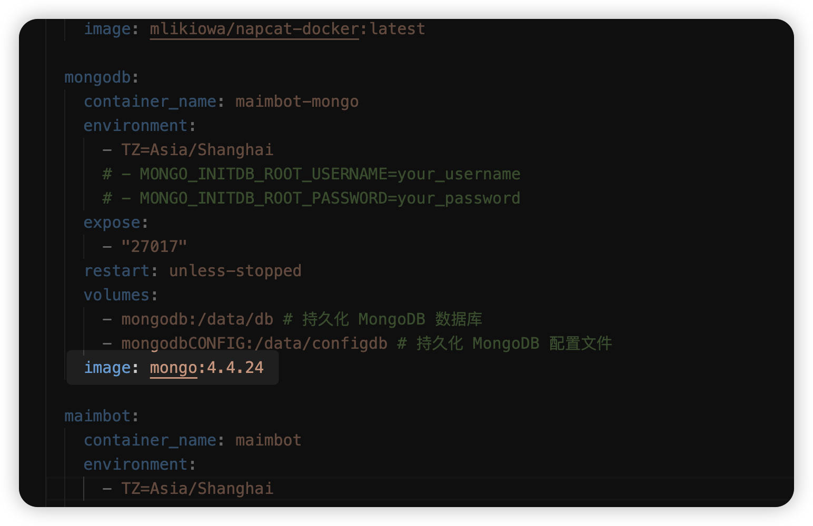
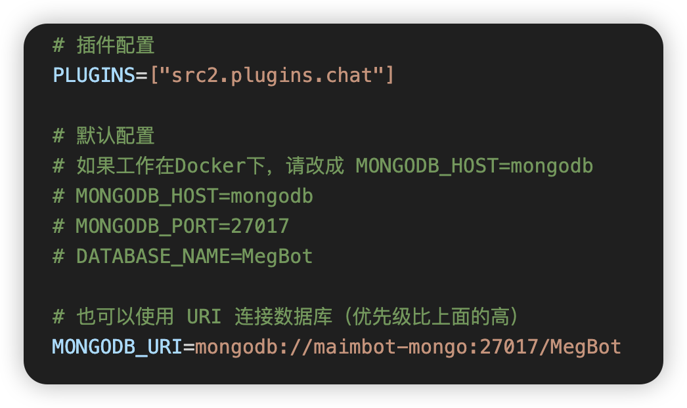
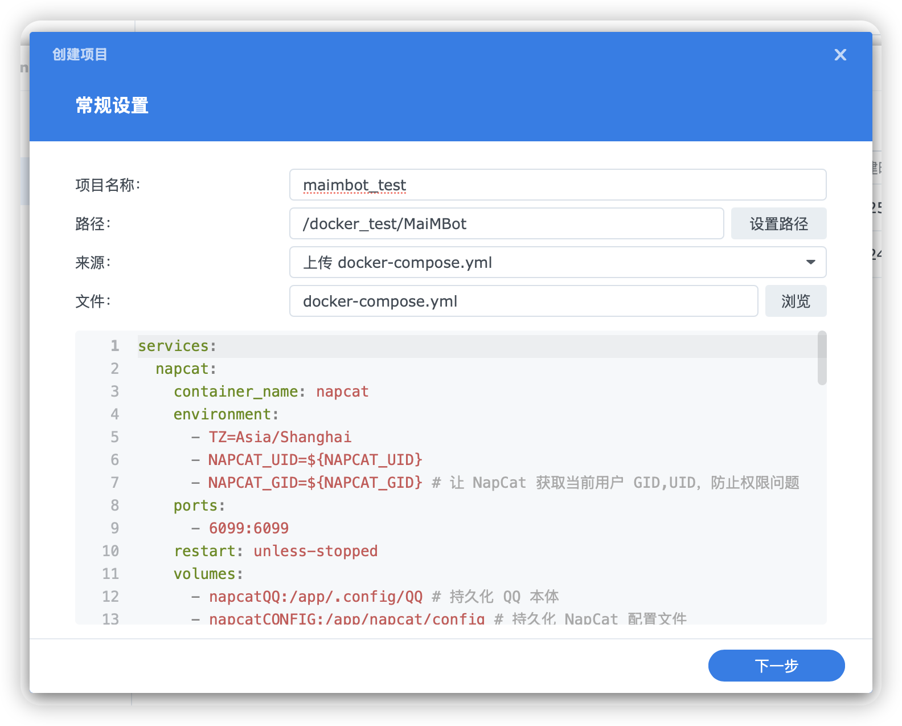

# 群晖 NAS 部署指南

**笔者使用的是 DSM 7.2.2，其他 DSM 版本的操作可能不完全一样**
**需要使用 Container Manager，群晖的部分部分入门级 NAS 可能不支持**

## 部署步骤

### 创建配置文件目录

打开 `DSM ➡️ 控制面板 ➡️ 共享文件夹`，点击 `新增` ，创建一个共享文件夹
只需要设置名称，其他设置均保持默认即可。如果你已经有 docker 专用的共享文件夹了，就跳过这一步

打开 `DSM ➡️ FileStation`， 在共享文件夹中创建一个 `MaiMBot` 文件夹

### 准备配置文件

docker-compose.yml: https://github.com/SengokuCola/MaiMBot/blob/main/docker-compose.yml
下载后打开，将 `services-mongodb-image` 修改为 `mongo:4.4.24`。这是因为最新的 MongoDB 强制要求 AVX 指令集，而群晖似乎不支持这个指令集

bot_config.toml: https://github.com/SengokuCola/MaiMBot/blob/main/template/bot_config_template.toml
下载后，重命名为 `bot_config.toml`
打开它，按自己的需求填写配置文件

.env.prod: https://github.com/SengokuCola/MaiMBot/blob/main/template.env
下载后，重命名为 `.env.prod`
将 `HOST` 修改为 `0.0.0.0`，确保 maimbot 能被 napcat 访问
按下图修改 mongodb 设置，使用  `MONGODB_URI`

把 `bot_config.toml` 和 `.env.prod` 放入之前创建的 `MaiMBot`文件夹

#### 如何下载？

点这里！

### 创建项目

打开 `DSM ➡️ ContainerManager ➡️ 项目`，点击 `新增` 创建项目，填写以下内容：

- 项目名称： `maimbot`
- 路径：之前创建的 `MaiMBot` 文件夹
- 来源： `上传 docker-compose.yml`
- 文件：之前下载的 `docker-compose.yml` 文件

图例：

一路点下一步，等待项目创建完成

### 设置 Napcat

1. 登陆 napcat
   打开 napcat： `http://<你的nas地址>:6099` ，输入token登陆
   token可以打开 `DSM ➡️ ContainerManager ➡️ 项目 ➡️ MaiMBot ➡️ 容器 ➡️ Napcat ➡️ 日志`，找到类似 `[WebUi] WebUi Local Panel Url: http://127.0.0.1:6099/webui?token=xxxx` 的日志
   这个 `token=` 后面的就是你的 napcat token

2. 按提示，登陆你给麦麦准备的QQ小号

3. 设置 websocket 客户端
   `网络配置 -> 新建 -> Websocket客户端`，名称自定，URL栏填入 `ws://maimbot:8080/onebot/v11/ws`，启用并保存即可。
   若修改过容器名称，则替换 `maimbot` 为你自定的名称

### 部署完成

找个群，发送 `麦麦，你在吗` 之类的
如果一切正常，应该能正常回复了